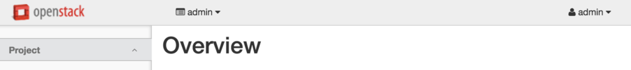
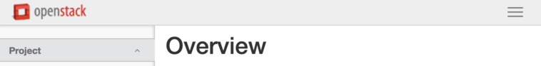
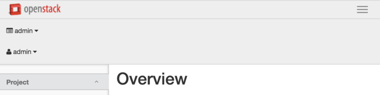

# Tips for the Certified OpenStack Administrator (COA) exam

The COA Exam user interface takes some getting used to. The purpose of this document is to address those aspects of the user interface and testing environment that the writer found most troublesome, and whose learning consumed valuable time. This document is based on experience taking the exam on a MacBook Pro running Mac OS X "El Capitan" (10.11.6).

[Soapbox: It would be nice if they provided up to fifteen minutes to explore
the exam user interface, before starting the clock.]

The COA Exam window comprises:

* along the top of the UI, a collection of Exam Window controls

* a left-hand frame, with the exam Exercise number and instructions

* a right-hand frame, with two tabs: OpenStack Web UI and OpenStack Server Terminal; **this is where you perform your work**

Example screenshots can be viewed in the "COA Training Slides".

## Exam Window controls

### Refresh Exam Window button

The "COA Candidate Handbook" states:

> The Refresh Exam Window button can be used to refresh the OpenStack Server Terminal (panel furthest to right) without reloading the entire webpage.
>
>* For example, if the OpenStack Server Terminal is experiencing latency issues that are not affecting the Help Center or Exam Content panels, clicking the Refresh Exam Window button may help.

Caveats:

* When you press this button, the exam goes back to Exercise #1. _Be sure to remember where you left off,_ **as you will have to click through all the prior Exercises you completed. This will consume precious time.**

* Login again to the Terminal session.

* Examine the OpenStack Web UI settings, to **verify you are in the correct Project**; you will likely want to verify the Project is "admin".

## OpenStack Web UI

In the Exam environment, the Web UI (Horizon) is displayed in a narrow, collapsed window, where some UI components change location from where they appear in a wider window. For me, it was easy to forget which Project was currently selected. The narrow view has:

* Project selection at the top left

* Session Login settings, below the Project selection

_Project selection will likely default to an undesired setting._ **Verify the Project is "admin", and the Login Session is "admin".** Working within the wrong project may doom your chances of completing all exam exercises in the allotted time!

___
Normal (wide) view:

___
Narrow view, collapsed:

___
Narrow view, expanded:

___
## OpenStack Server Terminal tab

### LXC Containers

The OpenStack Server is built using _openstack-ansible_ in the _Liberty_ release. As such, the OpenStack services run in LXC containers. You should be familiar with the `lxc-ls` and `lxc-attach` commands before taking the exam.

### Users: _student_ and _root_

The OpenStack Server Terminal logins to user _student_.

The _openrc_ file you will need, resides in the _root_ account. The COA Exam instructions recommend using `sudo -i`, but we recommend using `sudo su -` for most of the exam, if you are comfortable with running as _root_.

Note: Whereas you can to download the _openrc_ file by going to: Project > Access & Security > API Access, the downloaded file lands on your laptop -- rather than the OpenStack Server, where you need it.

### Terminal Multiplexer: _tmux_

For troubleshooting Exercises, you will need to locate and copy strings from LXC container logs, and paste those strings into specified files on the OpenStack Server. As this requires many copy and paste operations, you will likely want to run _tmux_ so you can have concurrent sessions logged in to LXC container(s) and the OpenStack Server.

_tmux_ is explicitly permitted, per the Candidate Handbook.

### Copy & Paste

Frame selection requires **one or more** right mouse clicks. To obtain focus, you may need to **wait a second or two** between mouse clicks.

You will frequently perform this sequence:

1. Command-C to Copy a string from the Exercise instructions frame

1. Right mouse click, one or more times, to gain focus in the Terminal or Web UI frame

1. Command-V to Paste into the Terminal or Web UI

## Study Review suggestions

### Swift syntax review

Swift CLI syntax help (`help` or `--help` for `python-swiftclient`) has some mistakes, so you should refer to the OpenStack Documentation site.  Most of the following are covered in the online course, but you may want to visit [the docs](docs.openstack.org) for a deeper dive or refresher, as many of us do not use these every day.

* Be sure you know all the Swift `read-acl` and `write-acl` syntax variants; specifically for referrers (`.r`), listings (`.rlistings`), projects, users, and user-within-project.

* Be sure you are familiar with the format for Extended HTML Request Headers such as `X-Delete-At` and `X-Delete-After`.

### Deploy using _openstack-ansible_

The COA Exam is currently based on the Liberty release, deployed with [openstack-ansible](https://github.com/openstack/openstack-ansible). If you are adventurous, you may wish to build your own OpenStack Server. This will allow you to become more familiar with the LXC Container environment, which would improve your troubleshooting skills.

The less adventurous can gain similar experience using the open virtual appliance (.ova file), as provided on the training site.

## References

* "The OpenStack Foundation Certification Candidate Handbook for OpenStack Foundation Certified OpenStack Administrator (COA), Version 1.0, Effective April 20, 2016", (COA-Candidate-Handbook-V1.6.22-3.pdf), The OpenStack Foundation

* "5 Sets of Tips for Before, During and After Your Exam", (COA-os-tipsdocument-0423.pdf), OpenStack Foundation

* "COA Training Slides", (COA-slides.pdf), Matt Dorn at Rackspace, per training.rackspace.com

* "COA Exam Advice", (COAExamAdvice.pdf), local Rackspace document as received via email
